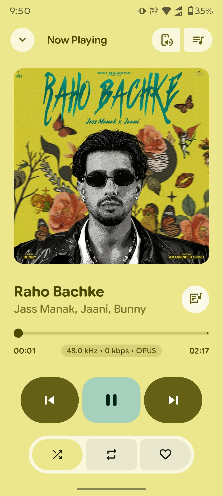
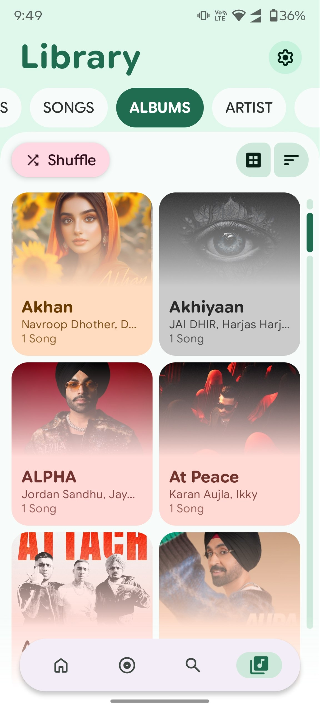
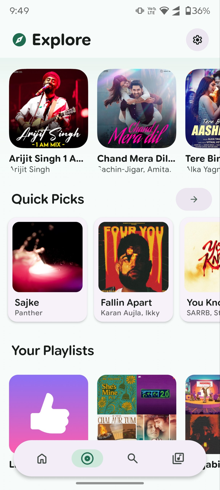

# PixelMusic 🎵

<p align="center">
  
</p>

<p align="center">
  <strong>The Ultimate Hybrid Local, Streaming, and Cloud Music Powerhouse for Android</strong><br>
  An elegant, feature-rich audio system built using Jetpack Compose, Material Design 3, and Media3 ExoPlayer.
</p>

<p align="center">
  
  
  
  
</p>

<p align="center">
  <a href="https://android.com">
    
  </a>
  <a href="https://kotlinlang.org">
    
  </a>
  <a href="LICENSE">
    
  </a>
  <a href="https://t.me/PixelMusicApp">
    
  </a>
  <a href="https://github.com/ianshulyadav/ThePixelMusic">
    
  </a>
</p>

---

> [!IMPORTANT]
> **PixelMusic is an independent, unofficial open-source fork of [PixelPlayerOSS](https://github.com/PixelPlayerHQ/PixelPlayerOSS).**
> It is **not** affiliated with, endorsed by, or sponsored by the PixelPlayerOSS project or its authors.
>
> **Original authors of PixelPlayerOSS:** [Theo Vilardo](https://github.com/theovilardo) & Duhan Yağmur Delikkulak
>
> This fork is licensed under the **GNU General Public License v3.0 (GPL-3.0)**. The original upstream MIT License notice is retained in [`LICENSE`](LICENSE) and [`PROVENANCE.md`](PROVENANCE.md) as required.

---

## 📖 Introduction & Philosophy

**PixelMusic** is an open-source third-party hybrid Android music client designed to bring local playback, user-authorized streaming sources, Telegram audio access, personal cloud libraries, and AI-assisted playlist creation into one polished experience.

PixelMusic supports local offline library indexing, high-resolution local file playback, synchronized lyrics, advanced audio controls, and optional third-party integrations. You can scan and play local files such as FLAC, ALAC, WAV, and MP3. You can also connect supported personal accounts or sources where authorized.

YouTube Music-related functionality is unofficial and intended only for personal use with content the user is authorized to access, subject to applicable laws and platform terms.

Beautifully styled with a state-of-the-art UI/UX, the interface adapts dynamically to the colors of your album artwork. The app includes synchronized LRC lyrics with manual timing offset adjustment, a professional 10-band equalizer, Chromecast support, Android Auto support, and a Wear OS companion experience.

---

## 🎨 UI/UX Excellence: Based on PixelPlayerOSS

PixelMusic's high-fidelity interface is built upon the GPL-3.0-licensed foundation of **[PixelPlayerOSS](https://github.com/PixelPlayerHQ/PixelPlayerOSS)**.

> [!NOTE]
> Credit and gratitude to **[PixelPlayerOSS](https://github.com/PixelPlayerHQ/PixelPlayerOSS)**, crafted by **Theo Vilardo** and **Duhan Yağmur Delikkulak**, for its original Android UI/UX foundation.

Key UI/UX visual paradigms adopted from PixelPlayerOSS include:

* **Dynamic Material You Theming:** High-precision HSL color extraction from album artwork that smoothly updates the player, bottom sheets, sliders, and navigation bar to match the mood of the current track.
* **Fluid Micro-Animations:** Seamless screen transitions, predictive back-swipe handling, physics-based scroll bars, and springy gesture-driven mini-players.
* **Premium Expressive Sliders:** Custom smooth-corner sliders and elegant volume control sheets that respond naturally to user touch.
* **State-of-the-Art Widgets:** Material 3 Glance home-screen widgets providing deep in-context customization and interactive controls directly from your launcher.

---

## ✨ Exhaustive Features List

### 🎵 1. Premium Audio Architecture
* **Advanced Media3 Engine:** Powered by Android's modern `androidx.media3.exoplayer` framework with customized caching pipelines.
* **FFmpeg Decoding Extension:** Native FFmpeg decoding libraries packed directly into the APK, enabling full compatibility for high-resolution formats like lossless **FLAC**, ALAC, WAV, APE, OPUS, OGG, and legacy MP3.
* **Professional 10-Band Equalizer:** High-fidelity hardware equalizer built in, including custom presets (Bass Booster, Vocal, Treble, Classical, etc.), bass boost, spatial virtualizer, and loudness enhancer.
* **Smart Volume Normalization:** Integration of EBU R128 loudness normalization algorithm to keep volume levels perfectly consistent across all local and streaming sources.
* **Seamless Audio Transitions:** Fully configurable crossfade (0s - 15s) and gapless playback engines to remove irritating pauses between tracks.

### 🌐 2. Ultimate Hybrid Streaming Capabilities
* **Unofficial YouTube Music Integration:** Provides user-authorized search and playback functionality through unofficial integrations. This feature is intended for personal use only and must be used in compliance with applicable laws and platform terms.
* **Secure Account Synchronization:** Securely sign into your YouTube Music account via a premium WebView container to sync your liked tracks, custom playlists, and subscribed artists.
* **Telegram Audio Pipeline:** Connect your Telegram account to directly stream and catalog music uploaded to your channels, chats, and saved messages.
* **Google Drive Integration (WIP):** Stream high-resolution personal audio libraries directly from cloud folders without taking up local storage.
* **Deezer Artist Artwork:** Dynamic querying of the Deezer API to auto-fetch high-quality cover art and backgrounds for all cataloged artists.

### 🎤 3. Real-Time Lyrics Pipeline
* **High-Precision LRC Engine:** Automated lyrics fetching using the LRCLIB API to display fully synchronized, scrolling lyrics.
* **Manual Lyrics Offset Search:** Refine synchronization timing offsets (millisecond granularity) if the text does not line up perfectly with the audio.
* **Offline Caching:** Lyrics are cached in the local Room database to ensure synchronization is preserved even when offline.
* **Live Translation & Romanization:** Translate foreign lyrics on the fly or view Romanized versions for easier listening.

### 🧠 4. Generative AI & Smart Mix Playlists
* **AI Music Assistant:** Feed custom prompts to generate highly personalized listening queues using Gemini, DeepSeek, OpenAI, or custom API proxies.
* **Smart Mix Playlist Generator (Last.fm Creator):** Supports 8 generation modes (Top Tracks, Recent Tracks, Similar Tracks/Artists, Genre, Recommendations, etc.) and a dedicated explore screen carousel.
* **Smart Mix Playlist Retention settings:** Configurable automated deletion policies (24 hours, 7 days, 30 days, or permanent) for generated AI playlists.
* **Smart Naming & Overwrite Logic:** Auto-generates clean playlist names and updates existing AI playlists in-place to avoid library duplication.

### 🎨 5. UI Customization & Sharing
* **Material You System Dynamic Colors:** A dedicated "Dynamic (System)" app color palette option utilizing native Android 12+ theme extraction.
* **Spotify-Style Snapchat Story Sharing:** Native integration with the official Snapchat Creative Kit SDK to share customized song/lyrics cards to Snapchat stories.
* **Share Card Customizer:** Supports dynamic pastel themes, frosted glassmorphism, deep blurred artwork backgrounds, and wavy seekbar animations.
* **Flexible Entry Screen:** Customize the app's default landing tab to launch directly into the Explore page, Search tab, or Library.

### 📲 6. Connectivity & Companion Ecosystem
* **Full Android Auto Support:** Fully compliant Android Auto integration leveraging Media3's robust `MediaLibraryService` for safe, simplified driving interfaces.
* **Chromecast Integration:** Cast local files and streaming media seamlessly to smart TVs, Chromecast dongles, and Nest speakers.
* **Wear OS Companion App:** High-performance Wear OS client that supports independent watch playback, queue transfers, local offline watch caching, and remote control of your phone's player.
* **Audiophile Statistics Hub:** Tracks listening history, daily playing times, favorite genres, most-played artists, and scrobbles natively to **Last.fm** and **ListenBrainz**.

### ⚡ 7. Performance & Compatibility Optimizations
* **Explore Screen Lazy Loading:** Phased rendering that loads core elements instantly and defers heavy background queries to asynchronous concurrent jobs.
* **MIUI/HyperOS Lockscreen Art Fix:** Dedicated custom `SharedArtworkContentProvider` implementation to bypass lockscreen background restrictions on Xiaomi/Redmi devices.
* **Database & Memory Adjustments:** Synchronized thread-safe queries, optimized param counts, and custom R8/ProGuard keep rules.

---

## 🛠️ Technology Stack

| Dependency / Layer | Description & Role |
|:---|:---|
| **Core Language** | 100% Kotlin with JVM 21 target |
| **UI Framework** | Jetpack Compose (Declarative UI) with Compose BOM |
| **Design Guideline** | Material Design 3 (M3 Expressive UI components) |
| **Media Player** | Jetpack Media3 (ExoPlayer + Session + UI + Transformer) |
| **Audio Processing** | ExoPlayer FFmpeg & MIDI extensions, EBU R128 normalization |
| **Database** | Room SQLite with incremental Kotlin Symbol Processing (KSP) |
| **Dependency Injection** | Dagger Hilt (Android and WorkManager modules) |
| **Network Core** | Ktor Client (Content Negotiation + Brotli encoding) & OkHttp |
| **API Parsing** | Retrofit + Gson + Kotlinx Serialization |
| **Image Loading** | Coil (Compose Image loading with database-backed LRU caching) |
| **Async Operations** | Kotlin Coroutines & Flow (StateFlow / SharedFlow architecture) |
| **Background Tasks** | WorkManager (scheduled backups, network refreshes, sync workers) |
| **Metadata Tagging** | TagLib / JAudioTagger fallback integration |
| **Widgets Framework** | Androidx Glance (Material 3 AppWidgets) |

---

## 🚀 Getting Started

### Prerequisites for Compiling
* **Android Studio Ladybug (2024.2.1)** or newer.
* **Android SDK 34** or higher (Target SDK is 37).
* **JDK 21** configured in your compilation environment.

### Compile Steps
1. **Clone the repository:**
   ```bash
   git clone https://github.com/ianshulyadav/ThePixelMusic.git
   cd ThePixelMusic
   ```
2. **Open the project in Android Studio:**
   * Android Studio will sync Gradle dependencies automatically.
3. **Configure API Keys (Optional but recommended):**
   * If you wish to use the AI Playlist generation features, insert your respective Gemini / DeepSeek API keys inside `local.properties`.
4. **Compile the APK:**
   * Run the `:app:assembleDebug` or `:app:assembleRelease` Gradle tasks.

---

## ⚖️ Disclaimer & Legal Notice

PixelMusic is an independent, community-driven third-party audio player. It is **not** associated with Google LLC, YouTube Music, Deezer, Telegram, Snapchat, Last.fm, ListenBrainz, or any of their parent companies.

PixelMusic is **not** affiliated with, endorsed by, or sponsored by the upstream **[PixelPlayerOSS](https://github.com/PixelPlayerHQ/PixelPlayerOSS)** project or its authors (Theo Vilardo, Duhan Yağmur Delikkulak).

* **No Media Hosting:** PixelMusic does not host, upload, or store copyrighted music files.
* **User Responsibility:** Users are responsible for ensuring that their usage complies with applicable laws, copyright rules, and platform terms.
* **Unofficial Integrations:** YouTube Music, Telegram, Deezer, Snapchat, Google Drive, Last.fm, ListenBrainz, and other integrations are unofficial unless explicitly stated otherwise.

---

## 📄 License

PixelMusic is licensed under the **GNU General Public License v3.0 (GPL-3.0)**. See [`LICENSE`](LICENSE) for the full text.

Portions of this project are based on **[PixelPlayerOSS](https://github.com/PixelPlayerHQ/PixelPlayerOSS)** by **Theo Vilardo** and **Duhan Yağmur Delikkulak**, originally made available under the GNU General Public License v3.0 (GPL-3.0). The original upstream copyright notice is retained in [`LICENSE`](LICENSE) and [`PROVENANCE.md`](PROVENANCE.md) as required.
